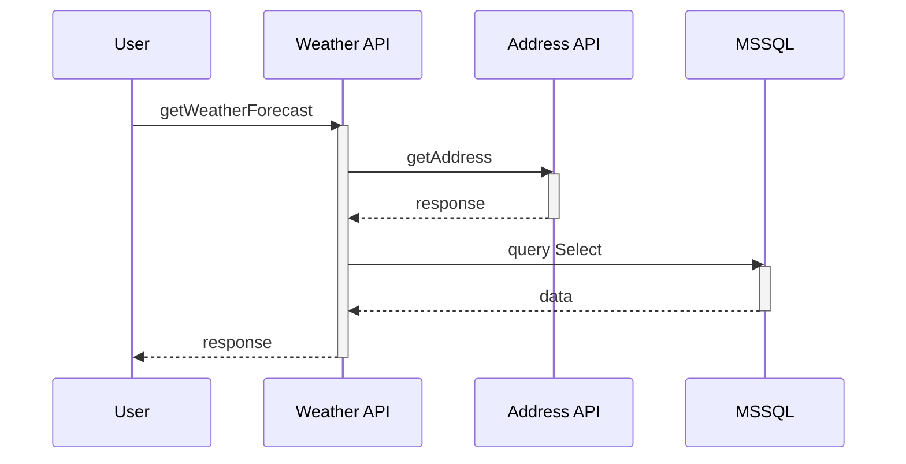

# Spring Boot observability with Prometheus, Jaeger, Loki and Grafana

Here, you could find an approach to face the Observability patterns for a Java application with Spring Boot ecosystem. The idea behind is to allow the teams for troubleshooting and helping them with the question, “Why and when is this happening?”. 

With the rise of cloud computing, microservices architectures, and ever-more complex business requirements, the need for Observability has never been greater. Observability is the ability to understand the internal state of a system by examining its outputs.

OpenTelemetry has become the industry standard and it will be the mechanism by which application code is instrumented in the way to fire signals such as traces, metrics and logs. An application will be properly instrumented when it will not need to add anything else to troubleshoot an issue.

The code was built in Spring Boot 2.7.11 using Java 8. To make that easier, the toolkit around the application (Grafana, Loki, Jaeger, Prometheus and SQL Server) will be setup using docker containers technology.

## Getting Started

The main idea of the source code hosted in this repository is to expose an API endpoint for retrieving a basic common weather forecast; to achieve telemetry squeezing, the logic inside uses some other external services like a public address API and MSSQL database for building a long path chain of dependencies and thus twist the troubleshooting. 

Please, find below the concept diagram for overview better understanding.



You could find in this repository the equivalent example built with DotNet Core technology: https://github.com/dloira/dls_DotNetTelemetry

### Solution scaffolding

Please find below the most relevant folders for landing at ease in the source code. As you could check, the solution was built with **Maven**; take a look for a while in this Apache official link https://maven.apache.org/:

> **root** <br>
> &nbsp; pom.xml *--> Maven descriptor file*<br>
> &nbsp; Dockerfile *--> Docker containers descriptor file*

> **src/main/java** <br>
> &nbsp; dls.telemetry *--> Package for application source code*

> **src/main/resources** <br>
> &nbsp; application.properties *--> Application configuration file*
> &nbsp; logback.xml *--> Application log configuration file*

> **src/test** <br>
> &nbsp; dls.telemetry *--> Package for testing source code application features*

Drilling down the **src/main/dls.telemetry** project folder tree, you could ckeck how it is based on the dependencies injection principles with Spring Boot and how it is burning its integration capabilities using Spring Secutiry and MyBatis ORM:

> **ApplicationConfig.java** *--> Starting point where SpringApplication class is used to bootstrap and launch the Spring application from the Java main method. This class automatically creates the ApplicationContext from the classpath, scan the configuration classes and launch the application.*<br>
> **SwaggerConfig.java** *--> Swagger configuration bean for API structure description*<br>
> **features** *--> Weather forecast endpoint API logic*<br>
> **diagnostics** *--> Metrics and logging deffinition*<br>
> **constants** *--> Static constant keys for application running*<br>

### POM structure

At this point, in the way to clarify the dependencies in use, it is relevant to go into the pom.xml file for a while. Dependency management is a critical aspect of any complex project and the less time spent on it the best; Spring Boot uses the Starter POMs to address exactly this problem. Starter POMs are a set of convenient dependency descriptors to get a one-stop-shop for all the Spring and related technology needed, without having to hunt through loads of dependency descriptors.

The **spring-boot-starter-parent** project is a special starter project that provides default configurations and a complete dependency tree to quickly build the Spring Boot project. In fact, this starter will provide the Sprint Boot version in use (none version will set up the latest one)

```xml
<parent>
    <groupId>org.springframework.boot</groupId>
    <artifactId>spring-boot-starter-parent</artifactId>
    <version>2.7.11</version>
    <relativePath/>
</parent>
```

This approach based on the use of the parent tag might not be feasible when you are working on multi-module project, where the parent tag could be needed to manage the projects hierarchy. In this case, it coould be solved using the **dependencyManagement** tag.

```xml
<dependencyManagement>
    <dependencies>
        <dependency>
            <groupId>org.springframework.boot</groupId>
            <artifactId>spring-boot-dependencies</artifactId>
            <version>2.7.11</version>
            <type>pom</type>
            <scope>import</scope>
        </dependency>
    </dependencies>
</dependencyManagement>
```

Within **properties** section the Java version and maven compiler are settled.

```xml
<properties>
    <java.version>1.8</java.version>
    <maven.compiler.source>1.8</maven.compiler.source>
    <maven.compiler.target>1.8</maven.compiler.target>
</properties>
```

The Spring Boot Maven Plugin is configured to execute the **repackage** goal; this is because the project will be executed in Docker containers and it is needed to add all the runtime dependencies inside the final artifact together with project classes. In this way, the repackaged artifact is executable using the command line java **-jar JAR_FILE.jar**.

```xml
<build>
    <plugins>
        <plugin>
            <groupId>org.springframework.boot</groupId>
            <artifactId>spring-boot-maven-plugin</artifactId>
            <version>2.7.11</version>
            <executions>
                <execution>
                    <goals>
                        <goal>repackage</goal>
                    </goals>
                </execution>
            </executions>
        </plugin>
    </plugins>
</build>
```

Dependencies tag describes the third party artifacts required to run the project source code; this section reflects the architecture designed to reach the solution. As it was described above, this POC exposes an API endpoint beind required the following Spring Boot starter.

```xml
<dependency>
    <groupId>org.springframework.boot</groupId>
    <artifactId>spring-boot-starter-web</artifactId>
</dependency>
<dependency>
    <groupId>org.springframework.boot</groupId>
    <artifactId>spring-boot-starter-test</artifactId>
    <scope>test</scope>
</dependency>
```

Micrometer is a metrics collection and reporting library for Java. It provides a simple way to instrument the application and record metrics that can be used to monitor the performance and health of the Spring Boot application; in few words, Micrometer dependency is used to configure the Spring Boot application to expose metrics in a format that Prometheus can scrape and store. Actuator dependency enables endpoints that expose information about metrics to be read it by Prometheus.

```xml
<dependency>
    <groupId>io.micrometer</groupId>
    <artifactId>micrometer-registry-prometheus</artifactId>
</dependency>
<dependency>
    <groupId>org.springframework.boot</groupId>
    <artifactId>spring-boot-starter-actuator</artifactId>
</dependency>
```

Jaeger provides a user interface that allows us to query for and analyze distribured traces. In other to set up the Spring Boot application for sending traces to Jaeger endpoint, it is mandatory to config properly the starter dependency.

```xml
<dependency>
    <groupId>io.opentracing.contrib</groupId>
    <artifactId>opentracing-spring-jaeger-cloud-starter</artifactId>
    <version>3.3.1</version>
</dependency>
```

Loki4j is the simplest way to push logs from the Java application to Loki and to connect them with all other metrics using Grafana dashboards.

```xml
<dependency>
    <groupId>com.github.loki4j</groupId>
    <artifactId>loki-logback-appender-jdk8</artifactId>
    <version>1.4.0</version>
</dependency>
<dependency>
    <groupId>org.apache.httpcomponents</groupId>
    <artifactId>httpclient</artifactId>
</dependency>
```

Finally, to prevent endpoints from being exposed without any authentication, Spring Security is added to protect them. On other hand, the SQL Server database accessing was made with MyBatis persistence ligthweigth framework. Moreover, the API endpoints were described with open API standard.

```xml
<dependency>
    <groupId>org.springframework.boot</groupId>
    <artifactId>spring-boot-starter-security</artifactId>
</dependency>
<dependency>
    <groupId>org.mybatis.spring.boot</groupId>
    <artifactId>mybatis-spring-boot-starter</artifactId>
    <version>2.1.3</version>
</dependency>
<dependency>
    <groupId>com.microsoft.sqlserver</groupId>
    <artifactId>mssql-jdbc</artifactId>
</dependency>
<dependency>
    <groupId>org.springdoc</groupId>
    <artifactId>springdoc-openapi-ui</artifactId>
    <version>1.7.0</version>
</dependency>
```

### Adding OpenTelemetry

1. Setup the OpenTelemetry properties within **application.properties** file in src/main/resources folder:

```properties
#Metrics related configurations
management.endpoints.web.exposure.include=*
management.endpoint.metrics.enabled=true
management.endpoint.prometheus.enabled=true
management.metrics.export.prometheus.enabled=true
#Distributed traces related configurations
opentracing.jaeger.http-sender.url: http://host.docker.internal:14268/api/traces
#Logs related configurations
logging.level.root:ERROR
```

2. Setup the Loki Logs properties within **logback.xml** file in src/main/resources folder:

```xml
<!-- Loki Appender -->
<appender name="lokiAppender" class="com.github.loki4j.logback.Loki4jAppender">
    <http class="com.github.loki4j.logback.ApacheHttpSender">
        <url>http://host.docker.internal:3100/loki/api/v1/push</url>
    </http>
    <format>
        <label>
            <pattern>app=JavaTelemetry,host=${HOSTNAME},level=%level</pattern>
        </label>
        <message>
            <pattern>l=%level h=${HOSTNAME} c=%logger{20} t=%thread | %msg %ex</pattern>
        </message>
        <sortByTime>true</sortByTime>
    </format>
</appender>

<logger name="dls.telemetry" level="INFO" />

<!-- Root Logger -->
<root level="INFO">
    <appender-ref ref="lokiAppender" />
</root>
```

3. Create the Metric and define the counter and histogram Measures in **ApplicationDiagnostics** public class:

```java
private MeterRegistry _meterRegistry;
	
private Counter _httpEventProcessingExceptions;
private Counter _httpEventProcessingCount;
private Timer _httpEventProcessingTime;

...

public ApplicationDiagnostics(MeterRegistry meterRegistry) {
    this._meterRegistry = meterRegistry;
    
    initializeCounters();
}

...

private void initializeCounters() {
    _httpEventProcessingCount = Counter.builder(ApplicationConstants.HTTP_EVENT_PROCESSING_COUNT_METRIC_NAME)
    .description(ApplicationConstants.HTTP_EVENT_PROCESSING_COUNT_METRIC_DESCRIPTION)
    .register(_meterRegistry);
    
    _httpEventProcessingExceptions = Counter.builder(ApplicationConstants.HTTP_EVENT_PROCESSING_COUNT_METRIC_NAME)
            .description(ApplicationConstants.HTTP_EVENT_PROCESSING_COUNT_METRIC_DESCRIPTION)
            .register(_meterRegistry);
    
    _httpEventProcessingTime = Timer.builder(ApplicationConstants.HTTP_EVENT_PROCESSING_TIME_METRIC_NAME)
            .description(ApplicationConstants.HTTP_EVENT_PROCESSING_TIME_METRIC_DESCRIPTION)
            .publishPercentiles(0.5, 0.95)
            .publishPercentileHistogram()
            .serviceLevelObjectives(Duration.ofMillis(100))
            .minimumExpectedValue(Duration.ofMillis(1))
            .maximumExpectedValue(Duration.ofSeconds(10))
            .register(_meterRegistry);
}
```

4. Trigger the diagnostics methods to run the metrics, logs and traces in **get** method within **WeatherForecastController** public class:

```java
public List<GetWeatherForecastResponse> get(){
    
    _diagnostics.EventReceived();
    
    try {
        StopWatch watchProcessor = new StopWatch();
        watchProcessor.start();
        
        ...
        
        watchProcessor.stop();
        
        _diagnostics.EventProcessed(watchProcessor.getTotalTimeMillis());
        
        ...
    }
    catch(Exception exception) {
        _diagnostics.EventProcessingFailed(exception);
    }
    
    return null;
}
```

## Running the pipeline

As it was mentioned before, the application dummy logic is not relevant here; however, checking its observability capabilities will be the main aim and the tests will be the proper bridge.

There were designed two diferent ways to test the application and the following sections will show you how to run each of them: Running the JavaTelemetry from Eclipse IDE / Running the JavaTelemetry from Docker container.

In one way or another, it will be needed to set up the telemetry toolkit with both approaches, in order to show dashboards in Grafana, receive distributed traces in Jaeger, collect metrics with Prometheus and receive logs with Loki.

### Telemetry toolkit

Docker Compose tool was used to provide an easy way to set up a local Grafana, Jaeger, Prometheus, Loki and SqlServer server where to send the telemetry information coming from the weather forecast API application.

This approach helps the way to landing over the observability main tools and allows us to focus on how the source code populates the metrics, distributed traces and logs.

The docker-compose.yaml file, within docker folder, build the images for running the containers network and populates the initial database.

Once you get installed Docker Desktop locally https://www.docker.com/products/docker-desktop/, to run the docker compose file it is only needed to run the terminal prompt, place the path where the file is and execute the following command.

```powershell
docker compose -f docker/docker-compose.yaml up --build -d
```

The containers will be ready as soon as you could watch the following result on the prompt command line:

```powershell
[+] Running 6/6
 - Network docker_default                 Created
 - Container docker-jaeger-1              Started
 - Container docker-prometheus-1          Started
 - Container docker-mssql-1               Started
 - Container docker-loki-1                Started
 - Container docker-grafana-1             Started
 ```

You could check how the tools are really up and running browsering the following links:

> **Grafana** --> http://localhost:3000 <br>
> &nbsp; Usr: admin <br>
> &nbsp; Pwd: password1 <br>
> **Jaeger** --> http://localhost:16686 <br>

It is important to remark the friendly way to surf the data when everything is integrated over the same tool like Grafana. By the way, before to consider for promoting to production environment, it will be needed to change the secrets lifecycle.

### Running the JavaTelemetry from Eclipse IDE

The easiest way to check the solution is running the **JavaTelemetry** project from Eclipse IDE directly; in this case, Swagger will be running on http://localhost:8080/swagger-ui/index.html and you could trigger a weather forecast request directly from it.

### Running the JavaTelemetry from Docker container

The application endpoint could also be run using containers technology; for this reason, DockerFile was built for building and executing the application automatically.

```docker
FROM openjdk:8-jdk-alpine AS base
WORKDIR /app
EXPOSE 8080
ARG JAR_FILE
COPY ./dls_JavaTelemetry/target/${JAR_FILE} /app
ENTRYPOINT ["java", "-jar", "dls_JavaTelemetry-0.0.1-SNAPSHOT.jar"]
```

Moreover, it was launch within a docker compose containers network to hands on it as easier as possible; you could take a look in docker-compose-apps.yaml file and run the everything together executing the following command line:

```powershell
docker compose -f docker/docker-compose.yaml -f docker/docker-compose-apps.yaml up --build -d
```

The containers will be ready as soon as you could watch the following result on the prompt command line:

```
[+] Running 7/7
 - Container docker-grafana-1             Created
 - Container docker-java-telemetry-1      Started
 - Container docker-prometheus-1          Started
 - Container docker-mssql-1               Started
 - Container docker-jaeger-1              Started
 - Container docker-loki-1                Started
 - Network docker_default                 Started
 ```

You could execute requests to the weather forecast endpoint running the browser and pasting the following URL as many times as you would like to fire a new request:

> http://localhost:8080/api/weatherForecast/

Tip: It will be also available the Swagger for checking the endpoint schema on http://localhost:8080/swagger-ui/index.html

## Results

Although there are so many other ways to analyze the telemetry data, Grafana will be the central tool to show the info. Once the login will be made, you could open the Dashboards section and open the default dashboard already loaded within the container start up. The screenshot bellow shows how were populated the custom metrics built in our weather forecast API application after 4 requests.


You could analyze the calling chain and its time tracking going over Jaeger section; here, there will be each request details where the database connection performance could be splitted for isolated analysis.


Finally, the logs were sent to Loki in real time and you could inspect them accessing to the Loki section in Grafana. 


## Running unit tests

The previous sections focus was to explain the way for providing observability into a web services façade, nevertheless, this repository also contains a clever approach to run the unit tests, without the need to have the API up in a separate instance.

As you could check, the test **WeatherForecastControllerMockMvcStandaloneTest** is using MockMvc as the testing framework available in SpringBoot and its features were taken advantage to test directly the Controller logic without needing a web server and not loading a Spring contex. To make it as easier as possible, a health check endpoint was added to the weather forecast endpoint in order to call it avoiding any other third party integration.

```java
@ExtendWith(MockitoExtension.class)
public class WeatherForecastControllerMockMvcStandaloneTest {

	private MockMvc mvc;

    @InjectMocks
    private WeatherForecastController weatherForecastController;
    
    @BeforeEach
    public void setup() {
        JacksonTester.initFields(this, new ObjectMapper());

        mvc = MockMvcBuilders.standaloneSetup(weatherForecastController)
                .build();
    }
    
    @Test
    public void healthCheckWhenRunning() throws Exception {
        MockHttpServletResponse response = mvc.perform(
                get("/api/weatherForecast/health")
                        .accept(MediaType.APPLICATION_JSON))
                .andReturn().getResponse();

        assertThat(response.getStatus()).isEqualTo(HttpStatus.OK.value());
        assertThat(response.getContentAsString()).isNotEmpty();       
    }
    
}
```

Prior to JUnit 5, MockitoJUnitRunner was used to run unit test. In the new JUnit version, the runner behaviors have been replaced by Extensions like **MockitoExtension**, which it is provided by Mockito and initializes automatically the annotated WeatherForecastController instance with @InjectMocks. It is relevant to remark Keep that’s not a real web server but simulated by MockMVC.

For the test, MockMVC is used to instance the fake GET request to the health endpoint. Over the MockHttpServletResponse returned the asserts will be executed.

You can execute the test clicking on **WeatherForecastControllerMockMvcStandaloneTest** with secondary button and select Run As / JUnit Test menu option. 


## Built With

* [Java-jdk1.8.0_102](https://www.oracle.com/es/java/technologies/javase/javase8-archive-downloads.html) - The java toolkit framework
* [Maven-3.3.9](https://repo.maven.apache.org/maven2/org/apache/maven/apache-maven/3.3.9/) - Dependency Management
* [SpringBoot-2.7.11](https://spring.io/projects/spring-boot) - Spring Boot
* [Eclipse](https://www.eclipse.org/downloads/packages/release/kepler/sr1/eclipse-ide-java-developers) - IDE
* [Micrometer.prometheus](https://opentelemetry.io/) - Prometheus exporter for OpenTelemetry by Micrometer
* [Micrometer.jaeger](https://opentelemetry.io/) - Jaeger exporter for OpenTelemetry by Micrometer
* [Loki.logback-1.4.0](https://loki4j.github.io/loki-logback-appender/) - Logback appender that writes log events to Grafana Loki
* [Jdbc.MSsql](https://learn.microsoft.com/en-us/sql/connect/jdbc/microsoft-jdbc-driver-for-sql-server?view=sql-server-ver16) - MSSQL driver
* [Mybatis-2.1.3](https://mybatis.org/mybatis-3/) - Lightweight persistence framework


## Versioning

I use [SemVer](http://semver.org/) for versioning. For the versions available, see the tags on this repository. 

# Quick Start

* Clone the repository.
* Open terminal console and change directory to be placed in project root folder.
* Run maven to build the .jar package: 

```powershell
mvn clean install
```

* Run docker compose to up the containers: 

```powershell
docker compose -f docker/docker-compose.yaml -f docker/docker-compose-apps.yaml up --build -d
```

* Grafana login will be available on: http://localhost:3000/
* Run docker compose to stop the containers: 

```powershell
docker compose -f docker/docker-compose.yaml -f docker/docker-compose-apps.yaml down
```